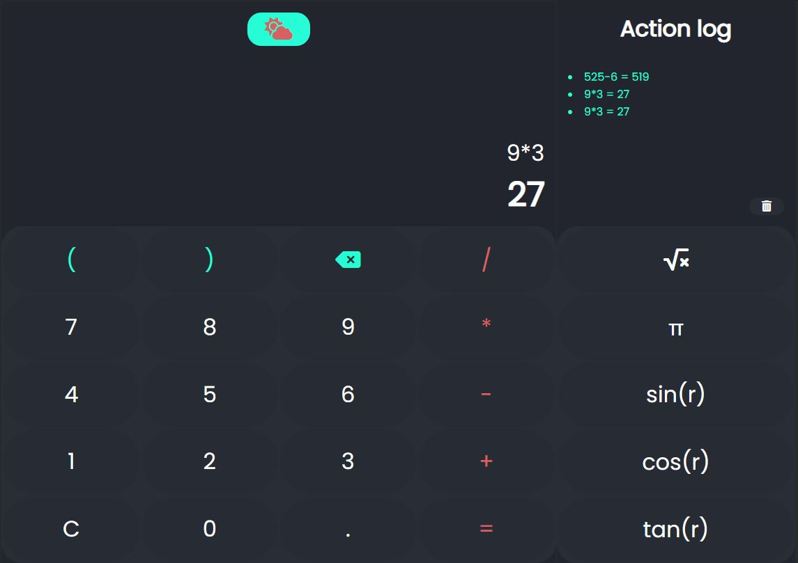

# Calculator

---

Basic Calculator, can do basic math,can toggle between Light and Dark Mode. Resposnive design.  Tracks last 5 actions

## Future tasks

- Add some more complex math buttons
- Unit converters

---

## Result

[Github Pages](https://kristinegusta.github.io/calculator/)

